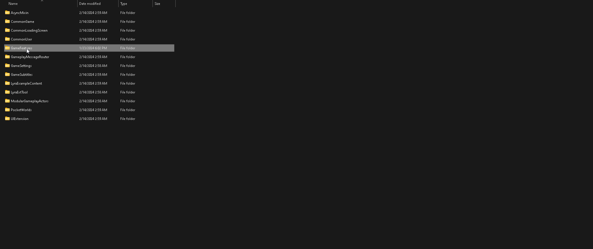
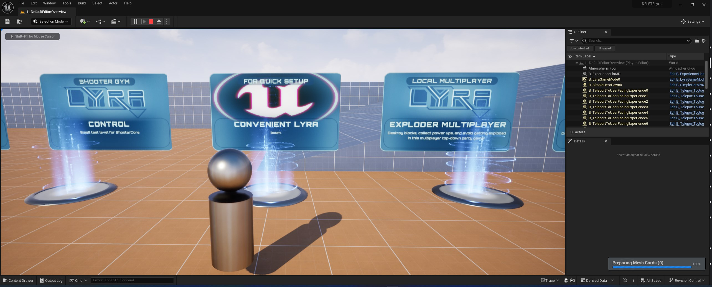

# LyraConveniencePlugin

This is a very simple base plugin to extend Unreal Engine's Lyra Starter Game in a modular fashion. I used this as a base to build my game upon.

Add the main files into LyraStarterGame/Plugins/GameFeatures/LyraConveniencePlugin - check that its enabled under plugins - and launch the map. I do remember having to setup something in order to have the AI working correctly (i believe a gamemode override somewhere), but I don't have the time right now to investigate how I solved that. -- there may be other extra steps involved. Feel free to open an issue for any concerns.

